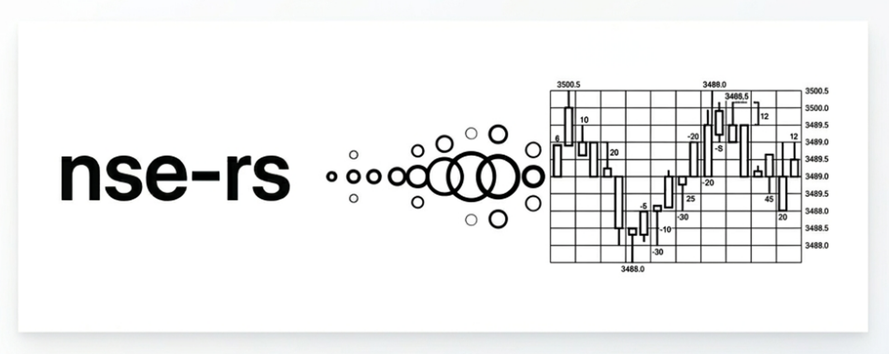

<p align="center">
  
</p>

<p align="center">
  <a href="https://github.com/ratan00/nse-rs"></a>
  
  
</p>

# nse-rs

An async Rust library for fetching live market data from the National Stock Exchange of India (NSE) — no API key or account required.

Provides live equity quotes, index quotes, structured option chains, futures, intraday & historical candles, polling feed loops, and EOD bhavcopy archives.

---

## Features

- **Live equity quotes** — flat `NseQuote` with LTP, OHLCV, change, volume
- **Live index quotes** — NIFTY 50, NIFTY BANK, FINNIFTY etc. via `get_index_quote()`
- **Structured option chain** — `OptionChain` grouped by expiry date → strike → CE/PE
- **Futures** — all contracts for a symbol filtered from derivatives
- **Historical candles** — 1/3/5/15/30/60 min intraday (30-day window) or D/W/M (25+ years)
- **Polling feed** — `poll_quote()` and `poll_index()` loops for simulated live streaming
- **EOD bhavcopy** — equity and F&O archives parsed into typed structs
- **Script token cache** — symbol → charting token cached in memory; no double-requests
- **Auto session retry** — cookie refresh on 403/decode failures, disk-cached for 1 hour
- **No OpenSSL** — uses `rustls-tls-native-roots`; cross-compiles cleanly

---

## Installation

```toml
[dependencies]
nse-rs = { git = "https://github.com/ratan00/nse-rs.git" }
tokio  = { version = "1", features = ["full"] }
chrono = "0.4"
```

---

## Quick Start

```rust
use nse_rs::NseClient;

#[tokio::main]
async fn main() -> anyhow::Result<()> {
    let client = NseClient::new();
    client.init_session().await?;

    // Flat live quote
    let quote = client.get_stock_quote("RELIANCE").await?;
    println!("{}: LTP ₹{:.2}  vol {}", quote.symbol, quote.ltp, quote.volume);

    // Index spot price
    let nifty = client.get_index_quote("NIFTY 50").await?;
    println!("NIFTY 50: {:.2}  ({:+.2}%)", nifty.last, nifty.change_pct);

    // Structured option chain
    let chain = client.get_option_chain("NIFTY").await?;
    for (expiry, rows) in &chain.expiries {
        println!("=== {} ===", expiry);
        for row in rows.iter().take(3) {
            println!("  {:>8.0}  CE {:.2}  PE {:.2}",
                row.strike, row.ce.ltp, row.pe.ltp);
        }
    }

    Ok(())
}
```

---

## API Reference

### `NseClient`

Create with `NseClient::new()`, then call `init_session().await?` before any data fetch.

#### Live data

| Method | Returns | Description |
|---|---|---|
| `get_stock_quote(symbol)` | `NseQuote` | Flat live quote for an equity (e.g. `"SBIN"`) |
| `get_index_quote(index_name)` | `NseIndexQuote` | Spot for an index (e.g. `"NIFTY 50"`, `"NIFTY BANK"`) |
| `get_option_chain(symbol)` | `OptionChain` | All options grouped by expiry/strike with CE+PE |
| `get_futures(symbol)` | `Vec<DerivativeContract>` | All futures contracts |
| `get_option_contracts(symbol)` | `Vec<DerivativeContract>` | Raw option contracts (unstructured) |
| `get_derivatives_quote(symbol)` | `NextApiDerivativesResponse` | Full raw derivatives response |
| `get_market_status()` | `MarketStatusResponse` | Open / Closed / Pre-market |

#### Polling feed

```rust
use tokio::sync::mpsc;

let (tx, mut rx) = mpsc::channel(64);

// Spawn a polling loop — sends a NseQuote every 3 seconds
tokio::spawn(async move {
    client.poll_quote("INFY", 3_000, tx).await;
});

while let Some(q) = rx.recv().await {
    println!("{}: ₹{:.2}", q.symbol, q.ltp);
}
```

`poll_index("NIFTY 50", interval_ms, tx)` works the same way for indices.

Both loops stop automatically when the receiver is dropped.

#### Historical candles

```rust
use chrono::Utc;

let end   = Utc::now();
let start = end - chrono::Duration::days(5);

// 5-minute intraday candles (market hours only, auto-filtered)
let candles = client.get_historical_candles("SBIN", start, end, "5").await?;

// Daily candles going back years
let daily = client.get_historical_candles("NIFTY", start, end, "D").await?;
```

Supported intervals: `"1"` `"3"` `"5"` `"15"` `"30"` `"60"` (minutes, max 30-day window) or `"D"` `"W"` `"M"` (unlimited history).

Intraday candles are automatically filtered to 09:15–15:30 IST.

#### EOD archives

```rust
use chrono::NaiveDate;

let date = NaiveDate::from_ymd_opt(2025, 6, 20).unwrap();

// Equity bhavcopy
let records = client.fetch_full_bhavcopy(date).await?;

// All actively trading symbol names for a date
let symbols = client.fetch_symbol_list(date).await?;

// F&O bhavcopy — typed structs, both pre/post July-2024 formats
let fo = client.fetch_fo_bhavcopy(date).await?;
for rec in fo.iter().take(5) {
    println!("{} {} {} @ {:.2}  OI {}", rec.symbol, rec.expiry, rec.option_type, rec.strike, rec.oi);
}
```

---

## Key Types

### `NseQuote`
```rust
pub struct NseQuote {
    pub symbol:       String,
    pub company_name: String,
    pub ltp:          f64,
    pub open:         f64,
    pub high:         f64,
    pub low:          f64,
    pub prev_close:   f64,
    pub close:        f64,
    pub change:       f64,
    pub change_pct:   f64,
    pub volume:       f64,
    pub traded_value: f64,
    pub year_high:    f64,
    pub year_low:     f64,
    pub last_update:  String,
}
```

### `OptionChain`
```rust
pub struct OptionChain {
    pub symbol:   String,
    // expiry date string → rows sorted by strike ascending
    pub expiries: BTreeMap<String, Vec<OptionChainRow>>,
}

pub struct OptionChainRow {
    pub strike: f64,
    pub ce:     OptionSide,
    pub pe:     OptionSide,
}

pub struct OptionSide {
    pub ltp:          f64,
    pub oi:           f64,
    pub change_in_oi: f64,
    pub volume:       f64,
}
```

### `FoBhavRecord`
```rust
pub struct FoBhavRecord {
    pub symbol:          String,
    pub expiry:          String,
    pub instrument_type: String, // "FUTIDX", "OPTIDX", "FUTSTK", "OPTSTK"
    pub option_type:     String, // "CE", "PE", or "-"
    pub strike:          f64,
    pub open:            f64,
    pub high:            f64,
    pub low:             f64,
    pub close:           f64,
    pub settle_price:    f64,
    pub contracts:       u64,
    pub oi:              u64,
    pub change_in_oi:    i64,
}
```

---

## Session & Cookie Management

NSE's web APIs require browser cookies (`nsit`, `nseappid`, etc.) obtained by hitting their landing page. `nse-rs` handles this transparently:

1. **Disk cache** at `~/.cache/nse-rs/session.json` — reused for up to 1 hour across process restarts
2. **Auto-refresh** — if a request returns a 403 or a decode error, the session is refreshed once and the request retried automatically
3. **Force refresh** — call `client.force_refresh_session().await?` to discard and re-fetch

---

## ⚠️ Cloud & Geo Restrictions

`www.nseindia.com` (live quotes, option chains, charting) enforces strict firewall rules:

- **Geo-blocking** — requests from IPs outside India are frequently rejected with 403 or TCP resets
- **Cloud IP blocking** — AWS, GCP, Azure, DigitalOcean and similar data-centre ranges are blocked even within India

**Run from a residential Indian internet connection.** Residential proxies are an alternative.

The archive domain `nsearchives.nseindia.com` (bhavcopy downloads) does **not** have these restrictions and works globally.

---

## Running the Example

```bash
cargo run --example demo
```

---

Credits: inspired by Python's `jugaad-data` and `nsemine` — rewritten in Rust for type safety, zero-cost abstractions, and no runtime overhead.

## License

MIT
