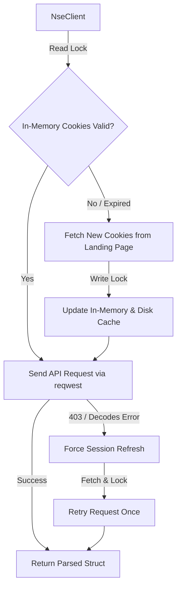
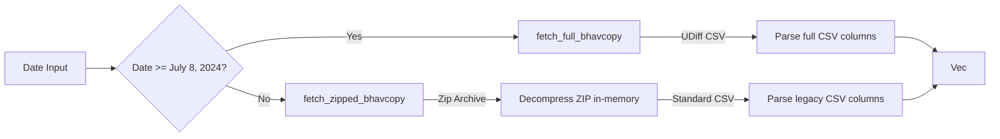

# nse-rs

`nse-rs` is a high-performance, async-first Rust library designed to fetch live equity quotes, futures, options, intraday charting candles, and historical EOD Bhavcopy archives from the National Stock Exchange of India (NSE). 

This library is inspired by Python's popular `jugaad-data` and `nsemine` libraries, rewritten from the ground up in pure Rust for type safety, zero-cost abstractions, multi-threaded safety, and low resource overhead.

---

## ⚡ Async Architecture & Design

`nse-rs` is designed for high-concurrency applications, prioritizing non-blocking I/O and thread-safe shared state.



### 1. Unified Client & Thread Safety
The main entry point is the `NseClient` struct. It wraps:
* A `reqwest::Client` pre-configured with realistic browser headers (User-Agent, Referer, Accept-Language, etc.) to mimic a standard desktop browser.
* An `RwLock<HashMap<String, String>>` storing cookie keys (like `nsit`, `nseappid`, etc.). This allows multiple threads to read cached cookies concurrently without contention, while restricting access only during an active cookie refresh.

### 2. Double-Layered Session Caching
To prevent IP blocks and minimize overhead, the client uses a disk-and-memory caching mechanism:
* **Disk Cache**: Sessions are persisted to disk at `~/.cache/nse-rs/session.json` (or the equivalent OS-specific cache folder resolved via the `dirs` crate).
* **TTL Check**: Before sending a request, the client checks if the cached session exists and is less than 1 hour old. If valid, it loads the cookies into memory without calling the NSE landing page.
* **Automatic Cookie Rotation**: If a session has expired (TTL > 1 hour) or a request returns a `403 Forbidden` or a payload decoding error (typical of expired sessions), `NseClient` performs an automated session refresh:
  1. Requests the NSE landing page: `https://www.nseindia.com/get-quote/equity/RELIANCE/Reliance-Industries-Limited`
  2. Extracts cookies from the `Set-Cookie` headers.
  3. Writes them back to the disk cache.
  4. Acquires an exclusive write lock on the in-memory cookie storage to update it.
  5. Retries the failed request.

### 3. Light Compilation footprint (Zero OpenSSL dependencies)
By using `rustls-tls-native-roots`, the crate avoids dependency on local OpenSSL library binaries, simplifying cross-compilation (e.g. compiling for AWS Lambda or Docker scratch containers).

---

## 📈 Feature Deep-Dive & Data Schemas

### 1. Live Stock Quotes (NextApi)
Live equity data is fetched from the NSE NextApi quotes endpoint.

* **Endpoint**: `https://www.nseindia.com/api/NextApi/apiClient/GetQuoteApi`
* **Query Params**: `functionName=getSymbolData`, `marketType=N`, `series=EQ`, `symbol=<SYMBOL>`
* **Rust Representation**: [`NextApiQuoteResponse`](file:///home/spidy/Documents/OT6.4/nse-rs/src/models.rs#L14-L18)

#### Data Schema & Types

```rust
pub struct NextApiQuoteResponse {
    pub equity_response: Option<Vec<EquityResponse>>,
}

pub struct EquityResponse {
    pub meta_data: Option<MetaData>,
    pub price_info: Option<PriceInfo>,
    pub trade_info: Option<TradeInfo>,
    pub sec_info: Option<SecInfo>,
    pub last_update_time: Option<String>, // format: "DD-MMM-YYYY HH:MM:SS"
}

pub struct MetaData {
    pub symbol: String,
    pub company_name: Option<String>,
    pub series: Option<String>,
    pub open: Option<f64>,
    pub day_high: Option<f64>,
    pub day_low: Option<f64>,
    pub previous_close: Option<f64>,
    pub change: Option<f64>,
    pub close_price: Option<f64>,
    pub p_change: Option<f64>, // percentage change
}

pub struct PriceInfo {
    pub year_high: Option<f64>,
    pub year_low: Option<f64>,
    pub lower_band: Option<f64>, // lower circuit limit
    pub upper_band: Option<f64>, // upper circuit limit
}

pub struct TradeInfo {
    pub total_traded_volume: Option<f64>,
    pub total_traded_value: Option<f64>, // value in Lakhs
    pub last_price: Option<f64>,         // LTP
}

pub struct SecInfo {
    pub isin_code: Option<String>,
    pub industry: Option<String>,
    pub sector: Option<String>,
}
```

#### Example JSON Response Structure
```json
{
  "equityResponse": [
    {
      "metaData": {
        "symbol": "SBIN",
        "companyName": "State Bank of India",
        "series": "EQ",
        "open": 845.0,
        "dayHigh": 849.9,
        "dayLow": 835.1,
        "previousClose": 843.9,
        "change": -4.7,
        "closePrice": 839.2,
        "pChange": -0.56
      },
      "priceInfo": {
        "yearHigh": 912.0,
        "yearLow": 550.0,
        "lowerBand": 759.5,
        "upperBand": 928.2
      },
      "tradeInfo": {
        "totalTradedVolume": 12903496.0,
        "totalTradedValue": 108634.38,
        "lastPrice": 839.2
      },
      "secInfo": {
        "isinCode": "INE062A01020",
        "industry": "Banks",
        "sector": "Financial Services"
      },
      "lastUpdateTime": "16-Jun-2026 15:30:00"
    }
  ]
}
```

---

### 2. Live Derivatives & Option Chains
Fetches live Futures and Options contracts for indices (e.g. NIFTY, BANKNIFTY) or stocks.

* **Endpoint**: `https://www.nseindia.com/api/NextApi/apiClient/GetQuoteApi`
* **Query Params**: `functionName=getSymbolDerivativesData`, `symbol=<SYMBOL>`
* **Rust Representation**: [`NextApiDerivativesResponse`](file:///home/spidy/Documents/OT6.4/nse-rs/src/models.rs#L88-L92)

#### Data Schema & Types

```rust
pub struct NextApiDerivativesResponse {
    pub data: Option<Vec<DerivativeContract>>,
    pub timestamp: Option<String>, // format: "DD-MMM-YYYY HH:MM:SS"
}

pub struct DerivativeContract {
    pub identifier: String,             // Unique contract code, e.g. "OPTIDXNIFTY25JUN2026CE17500.00"
    pub instrument_type: String,        // "FUTIDX", "OPTIDX", "FUTSTK", "OPTSTK"
    pub underlying: String,             // e.g., "NIFTY"
    pub expiry_date: String,            // format: "DD-MMM-YYYY"
    pub option_type: String,            // "Call", "Put", or "-" (for futures)
    pub strike_price: serde_json::Value,// Strike price (numeric or string representation)
    pub last_price: Option<f64>,        // LTP of the contract
    pub open_interest: Option<f64>,     // Total Open Interest (OI)
    pub change_in_open_interest: Option<f64>,
    pub p_change_in_open_interest: Option<f64>,
    pub total_traded_volume: Option<f64>, // Volume in contracts
    pub volume: Option<f64>,            // Traded value
}
```

#### Example Contract JSON Response Structure
```json
{
  "data": [
    {
      "identifier": "FUTIDXNIFTY25JUN2026",
      "instrumentType": "FUTIDX",
      "underlying": "NIFTY",
      "expiryDate": "25-Jun-2026",
      "optionType": "-",
      "strikePrice": 0,
      "lastPrice": 23450.75,
      "openInterest": 125400.0,
      "changeinOpenInterest": 1200.0,
      "pchangeinOpenInterest": 0.96,
      "totalTradedVolume": 45000.0,
      "volume": 105528.3
    },
    {
      "identifier": "OPTIDXNIFTY25JUN2026CE23500.00",
      "instrumentType": "OPTIDX",
      "underlying": "NIFTY",
      "expiryDate": "25-Jun-2026",
      "optionType": "Call",
      "strikePrice": 23500.00,
      "lastPrice": 125.40,
      "openInterest": 948000.0,
      "changeinOpenInterest": 45000.0,
      "pchangeinOpenInterest": 4.98,
      "totalTradedVolume": 185000.0,
      "volume": 435200.5
    }
  ],
  "timestamp": "16-Jun-2026 15:30:00"
}
```

---

### 3. Historical Intraday Charting (Interactive)
The library fetches historical tick data/candles directly from NSE's interactive charting microservices.

* **Endpoints**:
  1. **Dynamic search**: `https://charting.nseindia.com/v1/exchanges/symbolsDynamic?segment=&symbol=<SYMBOL>` to resolve the symbol's exact `scripcode` (referred to as `token` in the charting API).
  2. **Historical Data**: `https://charting.nseindia.com/v1/charts/symbolHistoricalData`
* **Rust Representation**: [`ChartCandle`](file:///home/spidy/Documents/OT6.4/nse-rs/src/models.rs#L129-L137)

#### Timestamp shifting & market Hours filter
1. **IST Time Shift**: The charting API requires the start/end parameters as epoch timestamps reflecting the Indian Standard Time (IST) offset (+5.5 hours). For intraday calls, `nse-rs` automatically adds `19800` seconds to the requested UTC timestamps before sending the query.
2. **Pre/Post-Market Filter**: Intraday ticks returned by NSE charting services often contain pre-market orders or block trade outliers outside the standard session. `nse-rs` automatically parses the millisecond timestamp of every candle back into IST and retains **only** candles between **09:15:00** and **15:30:00** IST.

#### Supported Intervals
* **Intraday Minutes**: `"1"`, `"3"`, `"5"`, `"15"`, `"30"`, `"60"`
* **Historical Daily/Weekly/Monthly**: `"D"`, `"W"`, `"M"`

#### Data Schema & Types

```rust
pub struct ChartCandle {
    pub time: i64,      // millisecond Unix timestamp in UTC
    pub open: f64,
    pub high: f64,
    pub low: f64,
    pub close: f64,
    pub volume: f64,
}
```

#### Example Candle Structure
```json
{
  "time": 1781601300000,
  "open": 843.50,
  "high": 845.20,
  "low": 843.10,
  "close": 844.75,
  "volume": 45120.0
}
```

---

### 4. Bulk Bhavcopy EOD Summaries
Bhavcopies are Daily End-of-Day (EOD) files covering all equities listed on the exchange. `nse-rs` supports two formats depending on the era of the historical date requested:



#### A. Modern Full Bhavcopy (UDiff)
Starting July 8, 2024, the NSE migrated to the Unified Daily Information File (UDiff) format, containing comprehensive trade data.
* **URL Structure**: `https://nsearchives.nseindia.com/products/content/sec_bhavdata_full_DDMMYYYY.csv`
* **Features**: Mapped directly from UDiff CSV values.

#### B. Legacy Zipped Bhavcopy
For older historical dates, the archive files are only available as compressed zip folders.
* **URL Structure**: `https://nsearchives.nseindia.com/content/historical/EQUITIES/YYYY/MMM/cmDDMMM[YYYY]bhav.csv.zip`
* **Features**: The client downloads the `.zip` binary over HTTP, reads the ZIP directory, and decompresses the inner CSV **entirely in-memory** using the `zip` crate. No file is ever written to disk.

#### Shared Rust Representation: [`HistoricalRecord`](file:///home/spidy/Documents/OT6.4/nse-rs/src/models.rs#L142-L156)

```rust
pub struct HistoricalRecord {
    pub date: String,            // format: "DD-MMM-YYYY"
    pub symbol: String,          // e.g. "SBIN"
    pub series: String,          // e.g. "EQ"
    pub open: f64,
    pub high: f64,
    pub low: f64,
    pub close: f64,
    pub previous_close: f64,
    pub ltp: f64,                // Last Traded Price (mapped from Last Price)
    pub volume: u64,             // Traded Quantity
    pub value: f64,              // Value (Turnover)
}
```

---

## 🚫 Cloud Blocks & Proxy Considerations

> [!WARNING]
> The primary domain `www.nseindia.com` (which hosts live stock quotes, options chains, and historical charting) implements strict firewall policies (Akamai and Cloudflare). 
> 
> * **Geo-Blocking**: Requests originating from IPs outside India are frequently blocked with a `403 Forbidden` or instant TCP resets.
> * **Data Center Blocking**: IPs associated with public cloud services (AWS, GCP, DigitalOcean, Azure, Hetzner, etc.) are actively blacklisted, even if the region is in India (e.g. `ap-south-1`).
> 
> **How to bypass this:**
> 1. Run the live scrapers from a residential/domestic internet connection in India.
> 2. Configure residential proxies on the client or environment level.
> 
> *Note: The historical EOD archive domain `nsearchives.nseindia.com` does not have these blocks, meaning bulk Bhavcopies can be downloaded globally from any cloud provider.*

---

## 📦 Installation

Add this to your project's `Cargo.toml`:

```toml
[dependencies]
nse-rs = { git = "https://github.com/ratan00/nse-rs.git" }
tokio = { version = "1.38", features = ["full"] }
chrono = "0.4"
```

---

## 💡 Complete Usage Example

Below is a complete implementation example showcasing the client lifecycle. It mirrors the included [`examples/demo.rs`](file:///home/spidy/Documents/OT6.4/nse-rs/examples/demo.rs) file.

```rust
use chrono::{Utc, NaiveDate, Duration};
use nse_rs::NseClient;

#[tokio::main]
async fn main() -> Result<(), Box<dyn std::error::Error + Send + Sync>> {
    println!("Initializing NseClient...");
    let client = NseClient::new();
    
    println!("Initializing session (loading cache or fetching new cookies)...");
    client.init_session().await?;
    println!("Session initialized successfully!");
    
    // 1. Fetch live stock quote for SBIN
    println!("\n--- Testing Stock Quote (SBIN) ---");
    match client.get_stock_quote("SBIN").await {
        Ok(quote) => {
            if let Some(resp) = quote.equity_response {
                if let Some(first) = resp.first() {
                    let symbol = first.meta_data.as_ref().map(|m| m.symbol.as_str()).unwrap_or("Unknown");
                    let ltp = first.trade_info.as_ref().and_then(|t| t.last_price).unwrap_or(0.0);
                    let name = first.meta_data.as_ref().and_then(|m| m.company_name.as_deref()).unwrap_or("");
                    println!("Stock Symbol: {}", symbol);
                    println!("Company Name: {}", name);
                    println!("Last Traded Price: {}", ltp);
                }
            }
        }
        Err(e) => println!("Error fetching stock quote (IP might be blocked by NSE): {}", e),
    }
    
    // 2. Fetch live derivative contracts for NIFTY
    println!("\n--- Testing Derivatives Quote (NIFTY) ---");
    match client.get_derivatives_quote("NIFTY").await {
        Ok(deriv) => {
            if let Some(data) = deriv.data {
                println!("Retrieved {} derivative contracts for NIFTY.", data.len());
                if let Some(contract) = data.first() {
                    println!("First Contract: {}", contract.identifier);
                    println!("Instrument Type: {}", contract.instrument_type);
                    println!("Expiry Date: {}", contract.expiry_date);
                    println!("Last Price: {}", contract.last_price.unwrap_or(0.0));
                    println!("Open Interest: {}", contract.open_interest.unwrap_or(0.0));
                }
            }
        }
        Err(e) => println!("Error fetching derivatives quote: {}", e),
    }

    // 3. Fetch historical charting data (intraday 5m candles)
    println!("\n--- Testing Intraday Charting Candles (SBIN) ---");
    let end_time = Utc::now();
    let start_time = end_time - Duration::days(5);
    match client.get_historical_candles("SBIN", start_time, end_time, "5").await {
        Ok(candles) => {
            println!("Retrieved {} intraday 5-minute candles.", candles.len());
            if !candles.is_empty() {
                println!("First candle: {:?}", candles.first().unwrap());
                println!("Last candle: {:?}", candles.last().unwrap());
            }
        }
        Err(e) => println!("Error fetching charting candles: {}", e),
    }

    // 4. Fetch full Bhavcopy (EOD Summary with delivery data)
    println!("\n--- Testing Full Bhavcopy (EOD Summary) ---");
    // June 15, 2026 (Monday)
    let test_date = NaiveDate::from_ymd_opt(2026, 6, 15).unwrap();
    match client.fetch_full_bhavcopy(test_date).await {
        Ok(records) => {
            println!("Downloaded full Bhavcopy: {} records.", records.len());
            if let Some(rec) = records.iter().find(|r| r.symbol == "SBIN") {
                println!("SBIN Bhavcopy Record: {:?}", rec);
            }
        }
        Err(e) => println!("Error fetching full Bhavcopy: {}", e),
    }

    // 5. Fetch zipped Bhavcopy
    println!("\n--- Testing Zipped Bhavcopy (EOD Summary) ---");
    // June 14, 2024 (Friday)
    let archive_date = NaiveDate::from_ymd_opt(2024, 6, 14).unwrap();
    match client.fetch_zipped_bhavcopy(archive_date).await {
        Ok(records) => {
            println!("Downloaded and parsed zipped Bhavcopy: {} records.", records.len());
            if let Some(rec) = records.iter().find(|r| r.symbol == "SBIN") {
                println!("SBIN Zipped Bhavcopy Record: {:?}", rec);
            }
        }
        Err(e) => println!("Error fetching zipped Bhavcopy: {}", e),
    }

    Ok(())
}
```

Run the demo from the workspace:
```bash
cargo run --example demo
```

---

## 📄 License

This library is licensed under the MIT License.
