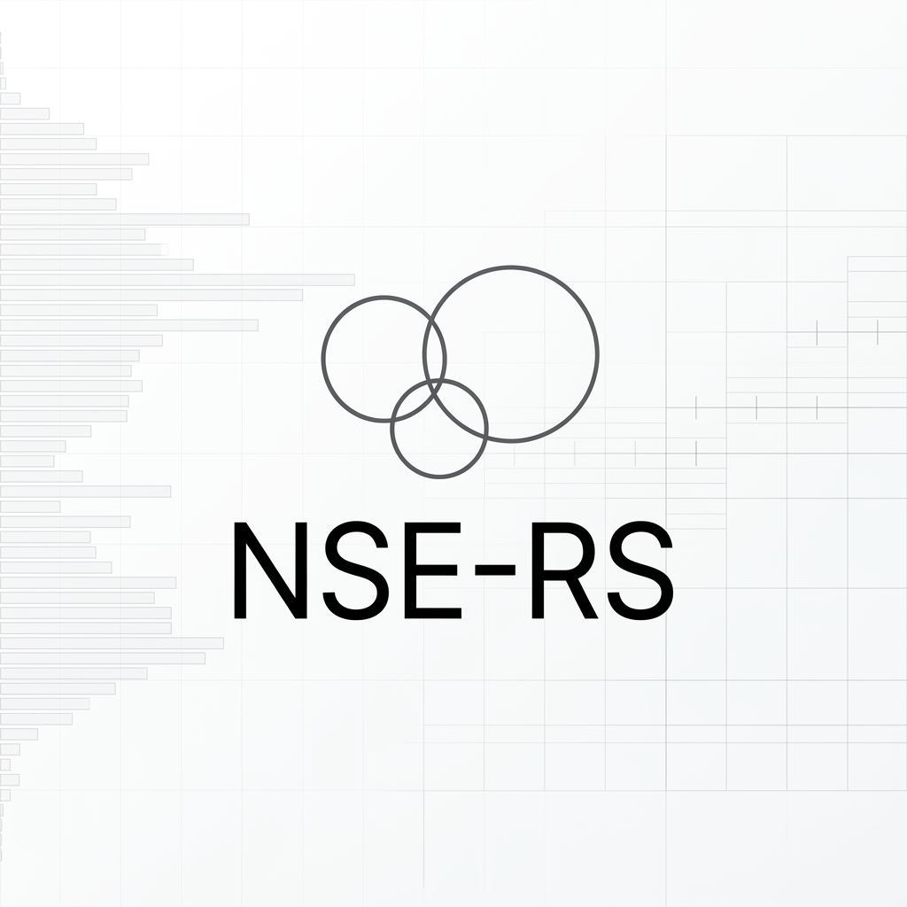
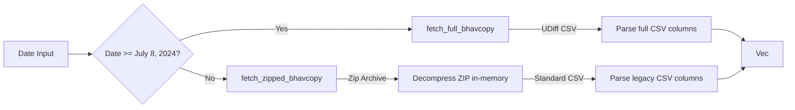

<p align="center">
  
</p>

<p align="center">
  <a href="https://github.com/ratan00/nse-rs"></a>
  
  
</p>

# nse-rs

`nse-rs` is a high-performance, async-first Rust library designed to fetch live equity quotes, futures, options, intraday charting candles, and historical EOD Bhavcopy archives from the National Stock Exchange of India (NSE). 


This library is inspired by Python's popular `jugaad-data` and `nsemine` libraries, rewritten from the ground up in pure Rust for type safety, zero-cost abstractions, multi-threaded safety, and low resource overhead.

---

## ⚡ Async Architecture & Design

`nse-rs` is designed for high-concurrency applications, prioritizing non-blocking I/O and thread-safe shared state.

### 1. Unified Client & Thread Safety
The main entry point is the `NseClient` struct. It wraps:
* A `reqwest::Client` pre-configured with realistic browser headers (User-Agent, Referer, Accept-Language, etc.) to mimic a standard desktop browser.
* An `RwLock<HashMap<String, String>>` storing cookie keys (like `nsit`, `nseappid`, etc.). This allows multiple threads to read cached cookies concurrently without contention, while restricting access only during an active cookie refresh.

### 2. Double-Layered Session Caching
To prevent IP blocks and minimize overhead, the client uses a disk-and-memory caching mechanism:
* **Disk Cache**: Sessions are persisted to disk at `~/.cache/nse-rs/session.json` (or the equivalent OS-specific cache folder resolved via the `dirs` crate).
* **TTL Check**: Before sending a request, the client checks if the cached session exists and is less than 1 hour old. If valid, it loads the cookies into memory without calling the NSE landing page.
* **Automatic Cookie Rotation**: If a session has expired (TTL > 1 hour) or a request returns a `403 Forbidden` or a payload decoding error (typical of expired sessions), `NseClient` performs an automated session refresh:

### 3. Light Compilation footprint (Zero OpenSSL dependencies)
By using `rustls-tls-native-roots`, the crate avoids dependency on local OpenSSL library binaries, simplifying cross-compilation (e.g. compiling for AWS Lambda or Docker scratch containers).

---

## 📈 Feature Deep-Dive & Data Schemas

### 1. Live Stock Quotes (NextApi)
Live equity data is fetched from the NSE NextApi quotes endpoint.

* **Endpoint**: `https://www.nseindia.com/api/NextApi/apiClient/GetQuoteApi`
* **Query Params**: `functionName=getSymbolData`, `marketType=N`, `series=EQ`, `symbol=<SYMBOL>`
* **Rust Representation**: [`NextApiQuoteResponse`](file:///home/spidy/Documents/OT6.4/nse-rs/src/models.rs#L14-L18)

#### How to Fetch:
```rust
let quote = client.get_stock_quote("SBIN").await?;
```

#### Example JSON Response Structure
```json
{
  "equityResponse": [
    {
      "metaData": {
        "symbol": "SBIN",
        "companyName": "State Bank of India",
        "series": "EQ",
        "open": 845.0,
        "dayHigh": 849.9,
        "dayLow": 835.1,
        "previousClose": 843.9,
        "change": -4.7,
        "closePrice": 839.2,
        "pChange": -0.56
      },
      "priceInfo": {
        "yearHigh": 912.0,
        "yearLow": 550.0,
        "lowerBand": 759.5,
        "upperBand": 928.2
      },
      "tradeInfo": {
        "totalTradedVolume": 12903496.0,
        "totalTradedValue": 108634.38,
        "lastPrice": 839.2
      },
      "secInfo": {
        "isinCode": "INE062A01020",
        "industry": "Banks",
        "sector": "Financial Services"
      },
      "lastUpdateTime": "16-Jun-2026 15:30:00"
    }
  ]
}
```

---

### 2. Live Futures (Derivatives)
Fetches live Futures contracts for indices (e.g. NIFTY, BANKNIFTY) or stocks.

* **Endpoint**: `https://www.nseindia.com/api/NextApi/apiClient/GetQuoteApi`
* **Query Params**: `functionName=getSymbolDerivativesData`, `symbol=<SYMBOL>`
* **Rust Representation**: [`NextApiDerivativesResponse`](file:///home/spidy/Documents/OT6.4/nse-rs/src/models.rs#L88-L92)

#### How to Fetch:
```rust
let futures = client.get_futures("NIFTY").await?;
```

#### Example Futures JSON Response Structure
```json
[
  {
    "identifier": "FUTIDXNIFTY25JUN2026",
    "instrumentType": "FUTIDX",
    "underlying": "NIFTY",
    "expiryDate": "25-Jun-2026",
    "optionType": "-",
    "strikePrice": 0,
    "lastPrice": 23450.75,
    "openInterest": 125400.0,
    "changeinOpenInterest": 1200.0,
    "pchangeinOpenInterest": 0.96,
    "totalTradedVolume": 45000.0,
    "volume": 105528.3
  }
]
```

---

### 3. Live Option Chains
Fetches live Option Chain contracts for indices (e.g. NIFTY, BANKNIFTY) or stocks.

* **Endpoint**: `https://www.nseindia.com/api/NextApi/apiClient/GetQuoteApi`
* **Query Params**: `functionName=getSymbolDerivativesData`, `symbol=<SYMBOL>`
* **Rust Representation**: [`NextApiDerivativesResponse`](file:///home/spidy/Documents/OT6.4/nse-rs/src/models.rs#L88-L92)

#### How to Fetch:
```rust
let option_chain = client.get_option_chain("NIFTY").await?;
```

#### Example Option Chain JSON Response Structure
```json
[
  {
    "identifier": "OPTIDXNIFTY16-06-2026CE24000.00",
    "instrumentType": "OPTIDX",
    "underlying": "NIFTY",
    "expiryDate": "16-Jun-2026",
    "optionType": "CE",
    "strikePrice": "   24000.00",
    "lastPrice": 0.05,
    "openInterest": 611314.0,
    "changeinOpenInterest": 15400.0,
    "pchangeinOpenInterest": 2.58,
    "totalTradedVolume": 185000.0,
    "volume": 435200.5
  }
]
```

---

### 4. Historical Intraday Charting (Interactive)
The library fetches historical tick data/candles directly from NSE's interactive charting microservices.

* **Endpoints**:
  1. **Dynamic search**: `https://charting.nseindia.com/v1/exchanges/symbolsDynamic?segment=&symbol=<SYMBOL>` to resolve the symbol's exact `scripcode` (referred to as `token` in the charting API).
  2. **Historical Data**: `https://charting.nseindia.com/v1/charts/symbolHistoricalData`
* **Rust Representation**: [`ChartCandle`](file:///home/spidy/Documents/OT6.4/nse-rs/src/models.rs#L129-L137)

#### Timestamp shifting & market Hours filter
1. **IST Time Shift**: The charting API requires the start/end parameters as epoch timestamps reflecting the Indian Standard Time (IST) offset (+5.5 hours). For intraday calls, `nse-rs` automatically adds `19800` seconds to the requested UTC timestamps before sending the query.
2. **Pre/Post-Market Filter**: Intraday ticks returned by NSE charting services often contain pre-market orders or block trade outliers outside the standard session. `nse-rs` automatically parses the millisecond timestamp of every candle back into IST and retains **only** candles between **09:15:00** and **15:30:00** IST.

#### Supported Intervals & Limits
* **Intraday Minutes** (`"1"`, `"3"`, `"5"`, `"15"`, `"30"`, `"60"`): **Strictly capped at a maximum history of 30 calendar days** from the current date. Any query requesting start dates beyond this window is automatically truncated by the NSE server.
* **Historical Daily/Weekly/Monthly** (`"D"`, `"W"`, `"M"`): Virtually unlimited history, returning **25+ years of data** (extending back to June 2001) in a single request.

#### How to Fetch:
```rust
let candles = client.get_historical_candles("SBIN", start_time, end_time, "5").await?;
```

#### Example Candle Structure
```json
{
  "time": 1781601300000,
  "open": 843.50,
  "high": 845.20,
  "low": 843.10,
  "close": 844.75,
  "volume": 45120.0
}
```

---

### 5. Bulk Bhavcopy EOD Summaries
Bhavcopies are Daily End-of-Day (EOD) files covering all equities listed on the exchange. `nse-rs` supports two formats depending on the era of the historical date requested:



#### A. Modern Full Bhavcopy (UDiff)
* **Availability**: For trading dates **on or after July 8, 2024**.
* **URL Structure**: `https://nsearchives.nseindia.com/products/content/sec_bhavdata_full_DDMMYYYY.csv`
* **Features**: Mapped directly from UDiff CSV values (includes delivery details).

#### B. Legacy Zipped Bhavcopy
* **Availability**: For historical trading dates **prior to July 8, 2024** (extending back to the early 2000s).
* **URL Structure**: `https://nsearchives.nseindia.com/content/historical/EQUITIES/YYYY/MMM/cmDDMMM[YYYY]bhav.csv.zip`
* **Features**: The client downloads the `.zip` binary over HTTP, reads the ZIP directory, and decompresses the inner CSV **entirely in-memory** using the `zip` crate. No file is ever written to disk.

#### How to Fetch:
```rust
let records = client.fetch_full_bhavcopy(date).await?;
```

---

## 🚫 Cloud Blocks & Proxy Considerations

> [!WARNING]
> The primary domain `www.nseindia.com` (which hosts live stock quotes, options chains, and historical charting) implements strict firewall policies (Akamai and Cloudflare). 
> 
> * **Geo-Blocking**: Requests originating from IPs outside India are frequently blocked with a `403 Forbidden` or instant TCP resets.
> * **Data Center Blocking**: IPs associated with public cloud services (AWS, GCP, DigitalOcean, Azure, Hetzner, etc.) are actively blacklisted, even if the region is in India (e.g. `ap-south-1`).
> 
> **How to bypass this:**
> 1. Run the live scrapers from a residential/domestic internet connection in India.
> 2. Configure residential proxies on the client or environment level.
> 
> *Note: The historical EOD archive domain `nsearchives.nseindia.com` does not have these blocks, meaning bulk Bhavcopies can be downloaded globally from any cloud provider.*

---

## 📦 Installation

Add this to your project's `Cargo.toml`:

```toml
[dependencies]
nse-rs = { git = "https://github.com/ratan00/nse-rs.git" }
tokio = { version = "1.38", features = ["full"] }
chrono = "0.4"
```

---

## 💡 Complete Usage Example

A complete, ready-to-run implementation example showcasing the client lifecycle and all available endpoints is located in the [examples/](file:///home/spidy/Documents/OT6.4/nse-rs/examples) directory.

You can run it directly from the workspace:
```bash
cargo run --example demo
```

---

## 📄 License

This library is licensed under the MIT License.
